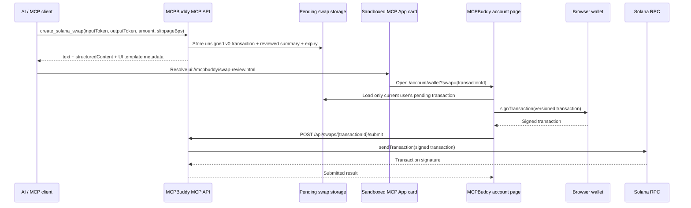

# MCP 工具返回 UI App：交易审阅与跳转机制

本文说明 MCPBuddy 如何让一个 MCP 工具在 AI 对话中返回可交互的 UI 卡片，并把用户安全地带到站内交易审阅页。

## 目标与边界

`create_solana_swap` 的职责是创建并保存一笔待签名交易，返回交易摘要和审阅入口；它不持有私钥，也不直接要求 AI 客户端签名。

交互 UI 分为两层：

1. **MCP App 卡片**：在支持 MCP Apps 的 AI 客户端中显示交易摘要与“打开审阅”按钮。
2. **MCPBuddy 账户页**：在用户自己的已登录浏览器会话中连接钱包、展示待签名记录并触发钱包签名。

卡片只负责展示和跳转，不能访问钱包，也不能广播交易。这是为了避免把钱包权限交给嵌入式、沙箱化的 AI 客户端 UI。

## 端到端流程



## 1. 注册 UI Resource

在 MCP 路由中为 UI 注册稳定的 `ui://` URI：

```ts
const SWAP_REVIEW_UI_URI = 'ui://mcpbuddy/swap-review.html';

server.registerResource(
  'solana-swap-review',
  SWAP_REVIEW_UI_URI,
  {
    title: 'Solana swap review',
    mimeType: 'text/html+skybridge',
    _meta: {
      'openai/widgetPrefersBorder': true,
      'openai/widgetAccessible': false,
    },
  },
  async () => ({
    contents: [{
      uri: SWAP_REVIEW_UI_URI,
      mimeType: 'text/html+skybridge',
      text: SWAP_REVIEW_UI,
    }],
  }),
);
```

`text/html+skybridge` 表示这是一个可由 MCP Apps bridge 托管的 HTML UI。`widgetAccessible: false` 表示卡片不直接成为可被模型任意调用的工具入口。

## 2. 工具声明关联 UI

工具声明通过 metadata 指向同一个 resource：

```ts
server.registerTool('create_solana_swap', {
  // ...inputSchema
  _meta: {
    'openai/outputTemplate': SWAP_REVIEW_UI_URI,
    'ui/resourceUri': SWAP_REVIEW_UI_URI,
  },
}, handler);
```

- `openai/outputTemplate`：供支持 OpenAI/ChatGPT Apps 的客户端加载卡片。
- `ui/resourceUri`：让其他兼容 MCP Apps 的客户端也能发现该 UI。
- 不支持 UI 的 MCP 客户端会忽略这些 metadata，继续显示普通文本结果，因此必须保留文本 fallback。

## 3. 返回模型文本与结构化数据

交易创建成功后，工具同时返回三类内容：

```ts
const output = {
  transactionId,
  expiresAt,
  summary,
  reviewUrl: `${origin}/account/wallet?swap=${transactionId}`,
  signingRequired: true,
  nextStep: 'Open reviewUrl to inspect and sign.',
};

return {
  content: [{ type: 'text', text: 'Unsigned SOL → USDC swap created…' }],
  structuredContent: output,
  _meta: { 'openai/outputTemplate': SWAP_REVIEW_UI_URI },
};
```

| 字段 | 消费方 | 用途 |
| --- | --- | --- |
| `content` | 模型和所有 MCP 客户端 | 可读 fallback，不能依赖 UI 才能完成理解。 |
| `structuredContent` | MCP App 卡片 | 稳定读取 `summary`、`expiresAt`、`reviewUrl` 等，不解析自然语言。 |
| `_meta.openai/outputTemplate` | MCP Apps 客户端 | 将本次结果绑定到对应 UI 模板。 |

不要在这些返回内容中包含私钥、完整签名交易、访问令牌或任何可复用的授权材料。

## 4. 卡片从 bridge 获取数据并跳转

卡片使用 `window.openai.toolOutput` 或 `window.openai.structuredContent` 读取工具输出；bridge 在工具完成后会触发 `openai:set_globals`，所以应在事件后重绘。

```js
function outputData() {
  const output = window.openai?.toolOutput || window.openai?.structuredContent || {};
  return output.summary ? output : (output.structuredContent || {});
}

window.addEventListener('openai:set_globals', render);

review.addEventListener('click', () => {
  if (currentData.reviewUrl) {
    window.open(currentData.reviewUrl, '_blank', 'noopener');
  }
});
```

必须使用 `noopener`，避免新页面通过 `window.opener` 控制嵌入卡片。卡片只打开 HTTPS 站内 `reviewUrl`，不应接收任意外部 URL。

## 5. 深链进入账户页并自动打开签名

链接形如：

```text
https://<app-origin>/account/wallet?swap=<transaction-id>
```

账户页读取 query 参数，把 ID 传给待签名队列：

```tsx
const { swap: autoSignId } = await searchParams;
const pendingSwaps = await pendingSwapsForUser(user.id);

return <PendingSwapsPanel swaps={pendingSwaps} autoSignId={autoSignId} />;
```

客户端组件只在以下条件同时满足时自动触发一次 `signOne`：

- URL 带有 `swap`；
- 该 ID 属于当前已登录用户的待签名队列；
- 本页生命周期尚未自动触发过。

`useRef` 的 one-shot guard 避免 React 重新渲染、页面状态变化或重复 bridge 事件导致钱包弹窗多次出现。

过期或过旧的交易不会直接签名：前端会请求 `/api/swaps/{id}/refresh`，然后跳转到新 ID 的 `/account/wallet?swap=<new-id>`。

## 6. 所有权、有效期与状态机

`transactionId` 只是定位符，不是授权凭据。每个 API 操作都必须按当前 MCPBuddy 用户过滤：

```ts
where(and(
  eq(swapTransactions.id, id),
  eq(swapTransactions.userId, userId),
));
```

推荐状态机：

```text
awaiting_signature → submitted
       │
       ├── delete → removed
       └── expired → create / refresh a new record
```

关键规则：

- 深链泄露不应让其他账户读取或签名该交易。
- 只允许删除 `awaiting_signature` 状态。
- 提交前检查记录有效期和链上 blockhash 的新鲜度。
- refresh 必须创建新的交易 ID；不能悄悄修改用户已经审阅的同一条记录。

## 7. 当前签名兼容性说明

账户页将 Jupiter v0 交易作为 `VersionedTransaction` 交给浏览器钱包的 `signTransaction`。当前启用了兼容模式：钱包返回的签名交易会直接广播，MCPBuddy 不再比较签名后的 message 是否仍与审阅 v0 message 相同。

这能兼容把 v0 重建成 legacy 的 provider，但安全代价是：最终广播内容以钱包确认页为准，而不再由 MCPBuddy 保证等同于 UI 卡片的审阅摘要。详见 [Solana 离线签名与广播](solana-offline-signing.md)。

## 实现位置

| 职责 | 文件 |
| --- | --- |
| MCP resource、工具 metadata、结构化输出与深链 | `app/api/mcp/route.ts` |
| 读取 `swap` query 参数、按当前用户加载队列 | `app/account/page.tsx` |
| 自动 review/sign、刷新、删除、提交 | `components/pending-swaps-panel.tsx` |
| 创建/保存/刷新/广播待签名交易 | `lib/solana-swap.ts` |
| 签名兼容性和风险说明 | `docs/solana-offline-signing.md` |
